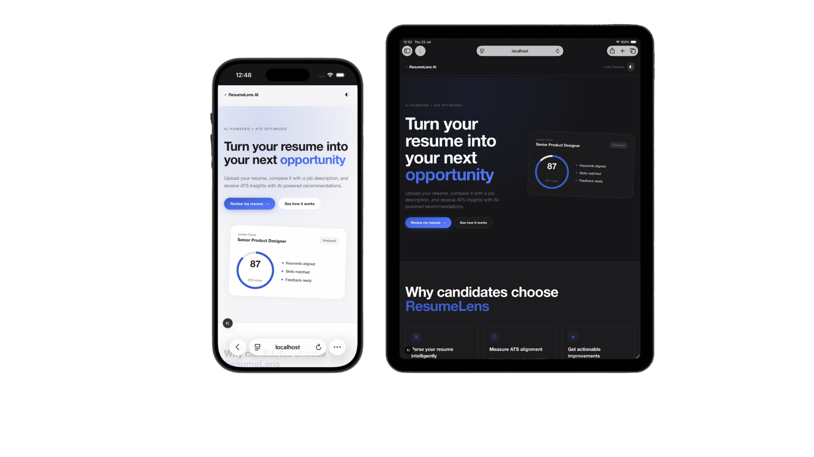
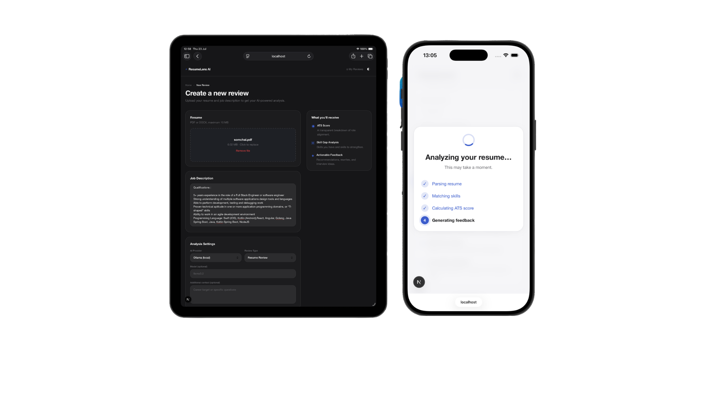
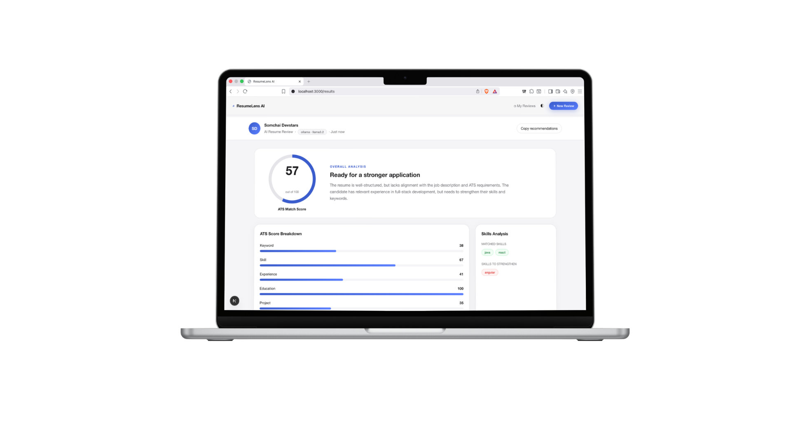
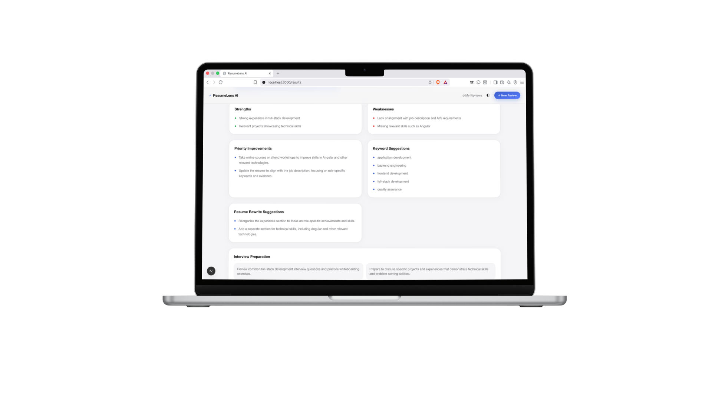

# ResumeLens AI

<div align="center">

<h3>🚀 AI-Powered Resume Reviewer & ATS Optimization Platform</h3>

Analyze resumes, measure ATS compatibility, identify skill gaps, and receive personalized AI feedback to improve your chances of landing interviews.

</div>

---

## ✨ Features

- 📄 Upload PDF/DOCX resumes
- 🤖 AI-powered resume analysis
- 📊 ATS compatibility scoring
- 🎯 Job description matching
- 🔍 Skill gap analysis
- 💡 Resume improvement suggestions
- 📝 Resume rewrite recommendations
- 🔑 Keyword optimization
- 🎤 Interview preparation tips
- 📱 Fully responsive (Desktop, Tablet, Mobile)

---

# Screenshots

## Landing Page

<p align="center">

</p>

---

## Create Review & AI Analysis Progress

<p align="center">

</p>

---

## Resume Analysis Result

<p align="center">

</p>

---

## Resume Analysis Feedback

<p align="center">

</p>

---

# Workflow

```text
Resume Upload
      │
      ▼
Document Validation
      │
      ▼
Resume Parser
      │
      ▼
Resume Normalizer
      │
      ▼
ATS Scoring Engine
      │
      ▼
Prompt Builder
      │
      ▼
AI Provider Layer
      │
      ▼
Response Parser
      │
      ▼
Feedback Formatter
      │
      ▼
Results Dashboard
```

---

# AI Pipeline

```
Resume
    │
    ▼
Resume Parsing
    │
    ▼
Extract Skills
Extract Experience
Extract Education
Extract Projects
    │
    ▼
ATS Score Calculation
    │
    ▼
Compare with Job Description
    │
    ▼
LLM Analysis
    │
    ▼
Feedback Generation
    │
    ▼
Resume Recommendations
```

---

# Tech Stack

## Frontend

- React
- TypeScript
- Vite
- React Router
- TailwindCSS
- Framer Motion

## Backend

- Node.js
- Express
- REST API

## AI

- Ollama
- Llama 3.2
- Prompt Engineering
- ATS Scoring Engine

## Database

- PostgreSQL
- Supabase

## File Processing

- PDF Parser
- DOCX Parser

---

# Project Structure

```text
ResumeLens-AI
│
├── frontend/
│   ├── components/
│   ├── pages/
│   ├── hooks/
│   ├── lib/
│   └── assets/
│
├── backend/
│   ├── routes/
│   ├── controllers/
│   ├── services/
│   ├── middleware/
│   └── utils/
│
├── ai/
│   ├── parser/
│   ├── scoring/
│   ├── prompts/
│   ├── providers/
│   └── formatter/
│
└── docs/
    └── images/
```

---

# Analysis Includes

✅ ATS Score

✅ Keyword Match

✅ Skills Match

✅ Experience Evaluation

✅ Education Review

✅ Project Assessment

✅ Resume Strengths

✅ Weaknesses

✅ Missing Skills

✅ Resume Rewrite Suggestions

✅ Interview Preparation

---

# Getting Started

## Clone Repository

```bash
git clone https://github.com/flupxscop/resumelens-ai.git

cd resumelens-ai
```

---

## Install Dependencies

```bash
npm install
```

---

## Start Development Server

```bash
npm run dev
```

---

## Backend

```bash
cd backend

npm install

npm run dev
```

---

# Environment Variables

Create a `.env` file.

```env
OLLAMA_BASE_URL=http://localhost:11434

OLLAMA_MODEL=llama3.2

DATABASE_URL=

SUPABASE_URL=

SUPABASE_ANON_KEY=
```

---

# Future Improvements

- [ ] Multi-language resume support
- [ ] GPT / Claude / Gemini integration
- [ ] Resume templates
- [ ] Cover letter generation
- [ ] Interview simulation
- [ ] AI career roadmap
- [ ] LinkedIn profile analysis
- [ ] Recruiter dashboard
- [ ] Resume version history

---

# Roadmap

- Resume Parser
- ATS Engine
- AI Feedback
- Job Matching
- Cover Letter AI
- Interview Coach
- Career Advisor

---

# Contributing

Contributions are welcome.

1. Fork the project
2. Create a feature branch

```bash
git checkout -b feature/my-feature
```

3. Commit changes

```bash
git commit -m "Add new feature"
```

4. Push

```bash
git push origin feature/my-feature
```

5. Open a Pull Request

---

# License

MIT License

---

<div align="center">

Made with ❤️ using React, TypeScript, Ollama and AI

**ResumeLens AI**

</div>
