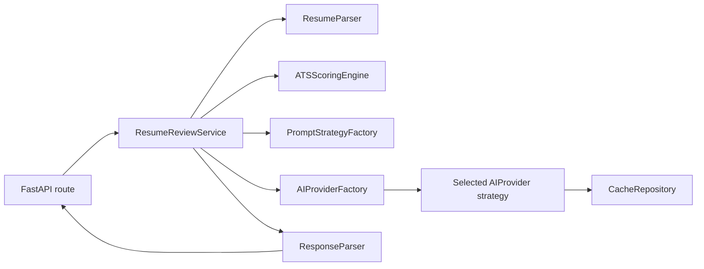

# AI Resume Reviewer Backend

Async, provider-independent FastAPI backend for extracting resume data, calculating ATS alignment, and generating normalized AI feedback.

## Architecture



The dependency direction is inward: API and provider adapters depend on application contracts; the ATS engine, Pydantic schemas, prompt strategies, and orchestration service never depend on a concrete vendor SDK or HTTP framework.

- **Strategy Pattern:** `AIProvider` and `PromptStrategy` select behavior at runtime.
- **Factory/Registry:** `AIProviderFactory` resolves `AI_PROVIDER` through the registered provider adapters.
- **Dependency Injection:** `api/dependencies.py` composes the parser, ATS engine, prompt factory, cache, provider factory, and response parser.
- **Repository Pattern:** `CacheRepository` separates service logic from cache storage; `InMemoryCacheRepository` is the default adapter.
- **Async safety:** document extraction and ATS CPU work run in worker threads; HTTP, caching, rate limiting, and retries are async.

## Setup

```bash
cd backend
python3.12 -m venv .venv
source .venv/bin/activate
pip install -e '.[dev]'
cp .env.example .env
```

Set `AI_PROVIDER` and only the corresponding API key in `.env`. Environment variables must be loaded by the deployment environment (for example, Docker Compose, a process manager, or your shell) before starting the server.

```bash
export AI_PROVIDER=openai
export OPENAI_API_KEY='replace-with-your-key'
uvicorn app.main:app --host 0.0.0.0 --port 8000
```

## API

`POST /api/v1/reviews` accepts `multipart/form-data`:

- `resume`: PDF or DOCX file, maximum 10 MB
- `job_description`: target role description, at least 20 characters
- `prompt_type`: `resume_review`, `cover_letter`, `interview_prep`, or `career_advice`
- `provider`: optional provider override
- `model`: optional provider-specific model override
- `additional_context`: optional candidate context

Example:

```bash
curl -X POST http://localhost:8000/api/v1/reviews \
  -F 'resume=@candidate.pdf' \
  -F 'job_description=We need a Python backend engineer with FastAPI and AWS experience.' \
  -F 'prompt_type=resume_review'
```

The response contains parsed resume data, deterministic ATS results, normalized feedback, and provider token usage. `GET /api/v1/health` provides a liveness check.

## Quality checks

```bash
pytest
ruff check app
```

For multi-instance production deployments, implement `CacheRepository` with Redis and apply rate limits at the gateway or distributed-cache layer; the service interfaces do not change.
